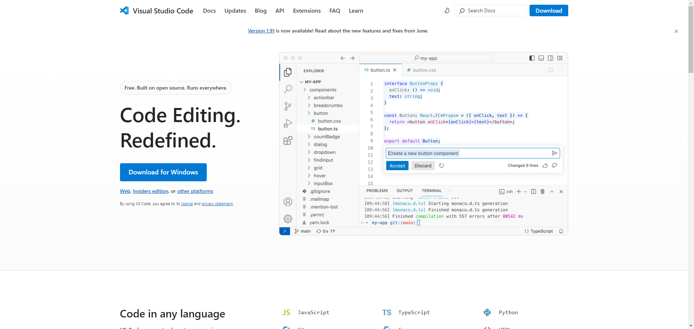
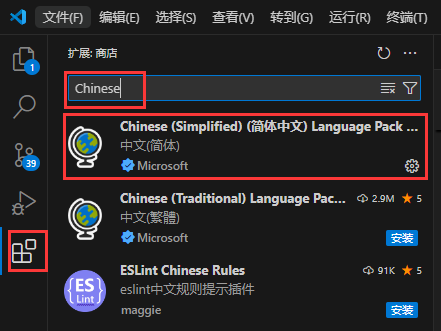
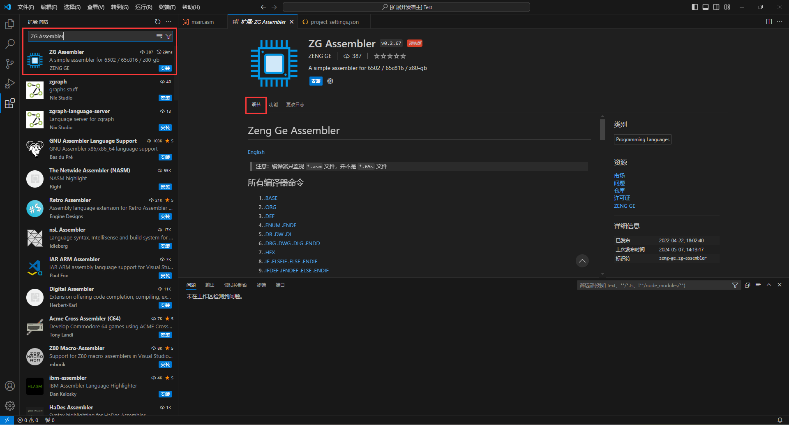

# VSCode及插件基本介绍

## 1. VSCode下载

前往网站 [https://code.visualstudio.com/](https://code.visualstudio.com/) 下载

点击 **Download for Windows** 即可

> 注：官网画面可能不一样，但是大同小异。

## 2. VSCode安装

按照安装程序的提示进行安装，该步骤不做过多说明。

## 3. 安装插件

打开VSCode，按照中文插件，方便以后使用。

安装完中文插件，搜索插件 `ZG-Assembler` 按照我的编译器插件。

`细节` 里面有所有编译器命令的使用方法